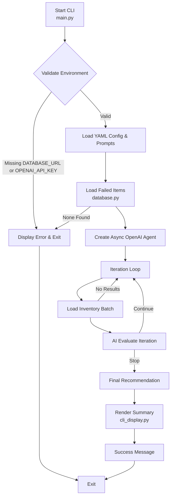
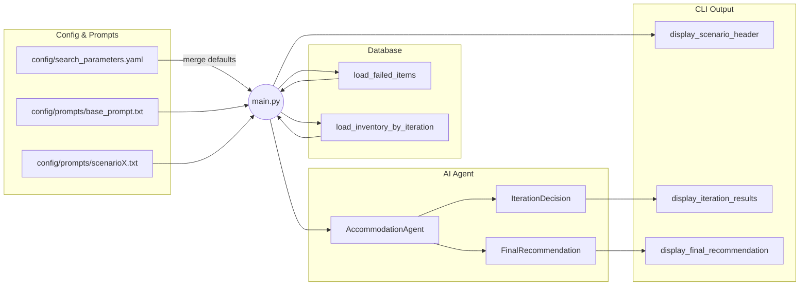

# Emergency Accommodation CLI Flow

```mermaid
flowchart TD
    A[Start CLI \n main.py] --> B{Validate Environment}
    B -->|Missing DATABASE_URL or OPENAI_API_KEY| E[Display Error & Exit]
    B -->|Valid| C[Load YAML Config & Prompts]
    C --> D[Load Failed Items \n database.py]
    D -->|None Found| E
    D --> F[Create Async OpenAI Agent]
    F --> G[Iteration Loop]
    G --> H[Load Inventory Batch]
    H -->|No Results| G
    H --> I[AI Evaluate Iteration]
    I -->|Continue| G
    I -->|Stop| J[Final Recommendation]
    J --> K[Render Summary \n cli_display.py]
    K --> L[Success Message]
    E --> M[Exit]
    L --> M
```

```mermaid
flowchart LR
    subgraph Config & Prompts
        C1[config/search_parameters.yaml]
        C2[config/prompts/base_prompt.txt]
        C3[config/prompts/scenarioX.txt]
    end

    subgraph Database
        D1[load_failed_items]
        D2[load_inventory_by_iteration]
    end

    subgraph AI Agent
        A1[AccommodationAgent]
        A2[IterationDecision]
        A3[FinalRecommendation]
    end

    subgraph CLI Output
        O1[display_scenario_header]
        O2[display_iteration_results]
        O3[display_final_recommendation]
    end

    C1 -->|merge defaults| mainCLI((main.py))
    C2 --> mainCLI
    C3 --> mainCLI
    mainCLI --> D1
    D1 --> mainCLI
    mainCLI --> D2
    D2 --> mainCLI
    mainCLI --> A1
    A1 --> A2
    A1 --> A3
    A2 --> O2
    A3 --> O3
    mainCLI --> O1
```
